# MEAN Stack Application - Containerized Deployment

A full-stack CRUD application built with the MEAN stack (MongoDB, Express, Angular 15, and Node.js), containerized with Docker and deployed to AWS EC2 with automated CI/CD pipeline.

## 📹 Demo Video

[](https://drive.google.com/file/d/1yhvbeH7Z_pNd4TMMmrpUjrtxu4KGtAuw/preview?usp=sharing&quality=hd1080)

*Click above to watch the complete demonstration of the application deployment, CI/CD pipeline, and features in highest quality.*

> **💡 Tip**: Click the settings gear icon in the video player and select the highest quality (1080p or higher) for best viewing experience.

## Table of Contents

- [Overview](#overview)
- [Architecture](#architecture)
- [Prerequisites](#prerequisites)
- [Quick Start](#quick-start)
- [Local Development Setup](#local-development-setup)
- [Docker Build and Run](#docker-build-and-run)
- [AWS EC2 Setup](#aws-ec2-setup)
- [CI/CD Pipeline Configuration](#cicd-pipeline-configuration)
- [Deployment Instructions](#deployment-instructions)
- [Environment Variables](#environment-variables)
- [Screenshots](#screenshots)
- [Troubleshooting](#troubleshooting)

## Overview

This project demonstrates modern DevOps practices by containerizing a MEAN stack application and automating its deployment to AWS infrastructure. The application manages a collection of tutorials with full CRUD operations and search functionality.

### Key Features

- **Containerization**: All services run in Docker containers for consistency across environments
- **Orchestration**: Docker Compose manages multi-container application stack
- **CI/CD Pipeline**: GitHub Actions automates build and deployment
- **Data Persistence**: MongoDB data persists across container restarts
- **Reverse Proxy**: Nginx routes traffic to appropriate services
- **AWS Deployment**: Deployed on EC2 instance with automated provisioning

### Application Features

- Create, Read, Update, Delete (CRUD) operations for tutorials
- Search tutorials by title
- Mark tutorials as published/unpublished
- RESTful API backend
- Responsive Angular frontend

## Architecture

### System Architecture

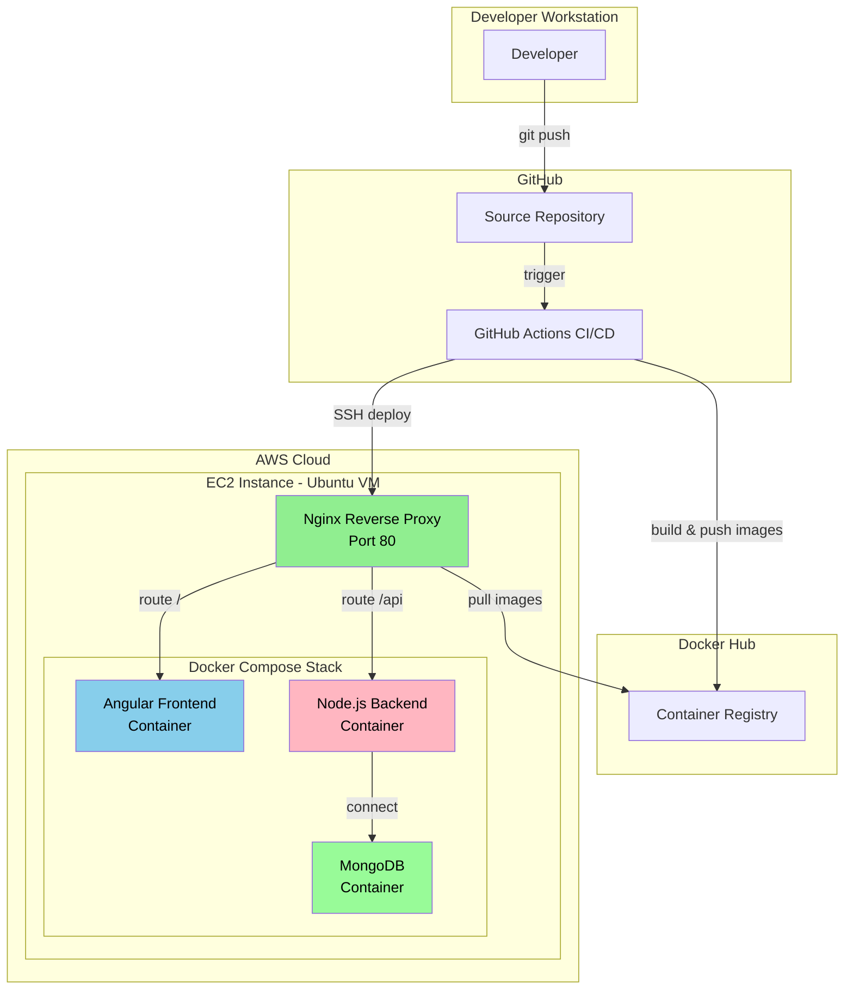

### Deployment Flow

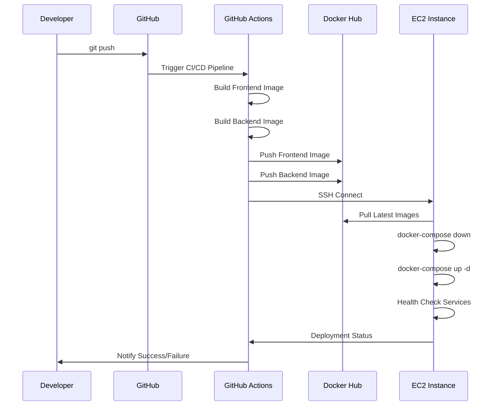

### Network Architecture

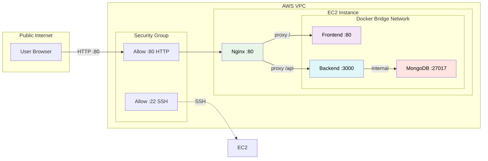

## Prerequisites

Before you begin, ensure you have the following:

### Required Software

- **Docker** (v20.10 or later) - [Install Docker](https://docs.docker.com/get-docker/)
- **Docker Compose** (v2.0 or later) - [Install Docker Compose](https://docs.docker.com/compose/install/)
- **Git** - [Install Git](https://git-scm.com/downloads)
- **Node.js** (v18 or later) - For local development only
- **Angular CLI** - For local development only: `npm install -g @angular/cli`

### Required Accounts

- **AWS Account** - [Create AWS Account](https://aws.amazon.com/free/)
- **GitHub Account** - [Sign up for GitHub](https://github.com/join)
- **Docker Hub Account** - [Sign up for Docker Hub](https://hub.docker.com/signup)

### AWS Resources

- EC2 instance (t2.micro or t3.micro for Free Tier)
- Security group with ports 80 (HTTP) and 22 (SSH) open
- SSH key pair for EC2 access

## Quick Start

### 1. Clone the Repository

```bash
git clone <your-repo-url>
cd <repo-name>
```

### 2. Create Environment File

```bash
# Copy example environment file
cp .env.example .env

# Edit with your configuration
nano .env
```

### 3. Run Locally with Docker Compose

```bash
# Build and start all services
docker-compose up -d

# View running containers
docker-compose ps

# View logs
docker-compose logs -f
```

### 4. Access the Application

- **Frontend**: http://localhost:80
- **Backend API**: http://localhost:80/api

### 5. Stop the Application

```bash
# Stop all containers
docker-compose down

# Stop and remove volumes (WARNING: deletes database data)
docker-compose down -v
```

## Local Development Setup

### Option 1: Using Docker Compose (Recommended)

```bash
# Start all services in development mode
docker-compose up -d

# View logs
docker-compose logs -f

# Restart a specific service
docker-compose restart backend

# Stop all services
docker-compose down
```

### Option 2: Running Services Individually

#### Backend Server

```bash
cd backend
npm install

# Update MongoDB credentials in app/config/db.config.js if needed
node server.js
```

The backend will run on `http://localhost:8080`.

#### Frontend Client

```bash
cd frontend
npm install

# Start development server
ng serve --port 8081
```

Navigate to `http://localhost:8081/` to access the application.

**Note**: You can modify `src/app/services/tutorial.service.ts` to adjust how the frontend interacts with the backend.

## Docker Build and Run

### Building Docker Images

```bash
# Build frontend image
docker build -t meanapp-frontend:local ./frontend

# Build backend image
docker build -t meanapp-backend:local ./backend

# List built images
docker images | grep meanapp
```

### Running with Docker Compose

```bash
# Start all services
docker-compose up -d

# View service status
docker-compose ps

# View logs for all services
docker-compose logs -f

# View logs for specific service
docker-compose logs -f backend

# Restart a service
docker-compose restart backend

# Stop all services
docker-compose down

# Rebuild and restart
docker-compose up -d --build
```

### Docker Compose Services

The `docker-compose.yml` file defines four services:

1. **MongoDB** - Database service with persistent volume
2. **Backend** - Node.js/Express API server
3. **Frontend** - Angular application served by Nginx
4. **Nginx** - Reverse proxy routing traffic to frontend and backend

### Verifying the Stack

```bash
# Check all containers are running
docker-compose ps

# Test backend health
curl http://localhost/api/tutorials

# Test frontend
curl http://localhost/

# Check MongoDB connection
docker-compose exec backend node -e "console.log('Backend can connect to MongoDB')"
```

## AWS EC2 Setup

### Step 1: Launch EC2 Instance

1. **Log in to AWS Console**
2. **Navigate to EC2 Dashboard**
3. **Click "Launch Instance"**
4. **Configure Instance**:
   - **Name**: `meanapp-server`
   - **AMI**: Ubuntu Server 22.04 LTS (Free Tier eligible)
   - **Instance Type**: t2.micro (Free Tier eligible)
   - **Key Pair**: Create new or select existing
   - **Network Settings**: 
     - Allow SSH (port 22) from your IP
     - Allow HTTP (port 80) from anywhere
5. **Configure Storage**: 30 GB gp2 (Free Tier limit)
6. **Launch Instance**

### Step 2: Connect to EC2 Instance

```bash
# Get your EC2 public IP from AWS Console
EC2_IP=<your-ec2-public-ip>

# SSH into the instance
ssh -i your-key.pem ubuntu@$EC2_IP
```

### Step 3: Install Docker and Docker Compose

```bash
# Update system packages
sudo apt-get update
sudo apt-get upgrade -y

# Install Docker
curl -fsSL https://get.docker.com -o get-docker.sh
sudo sh get-docker.sh

# Add ubuntu user to docker group
sudo usermod -aG docker ubuntu

# Install Docker Compose
sudo curl -L "https://github.com/docker/compose/releases/latest/download/docker-compose-$(uname -s)-$(uname -m)" -o /usr/local/bin/docker-compose
sudo chmod +x /usr/local/bin/docker-compose

# Verify installations
docker --version
docker-compose --version

# Log out and log back in for group changes to take effect
exit
```

### Step 4: Set Up Application Directory

```bash
# SSH back into EC2
ssh -i your-key.pem ubuntu@$EC2_IP

# Create application directory
mkdir -p /home/ubuntu/meanapp
cd /home/ubuntu/meanapp
```

### Step 5: Configure Security Group

Ensure your EC2 security group has the following inbound rules:

| Type | Protocol | Port Range | Source | Description |
|------|----------|------------|--------|-------------|
| SSH | TCP | 22 | Your IP/32 | SSH access |
| HTTP | TCP | 80 | 0.0.0.0/0 | Web traffic |

## CI/CD Pipeline Configuration

### GitHub Actions Workflow

The project uses GitHub Actions for automated CI/CD. The workflow is defined in `.github/workflows/deploy.yml`.

```yaml
name: Build and Deploy MEAN App

on:
  push:
    branches:
      - main
      - master
  workflow_dispatch:

jobs:
  build:
    runs-on: ubuntu-latest
    
    steps:
      - name: Checkout code
        uses: actions/checkout@v3
      
      - name: Set up Docker Buildx
        uses: docker/setup-buildx-action@v2
      
      - name: Login to Docker Hub
        uses: docker/login-action@v2
        with:
          username: ${{ secrets.DOCKER_USERNAME }}
          password: ${{ secrets.DOCKER_PASSWORD }}
      
      - name: Build and push frontend image
        uses: docker/build-push-action@v4
        with:
          context: ./frontend
          push: true
          tags: |
            ${{ secrets.DOCKER_USERNAME }}/meanapp-frontend:latest
            ${{ secrets.DOCKER_USERNAME }}/meanapp-frontend:${{ github.sha }}
      
      - name: Build and push backend image
        uses: docker/build-push-action@v4
        with:
          context: ./backend
          push: true
          tags: |
            ${{ secrets.DOCKER_USERNAME }}/meanapp-backend:latest
            ${{ secrets.DOCKER_USERNAME }}/meanapp-backend:${{ github.sha }}

  deploy:
    needs: build
    runs-on: ubuntu-latest
    
    steps:
      - name: Deploy to EC2
        uses: appleboy/ssh-action@master
        with:
          host: ${{ secrets.EC2_HOST }}
          username: ubuntu
          key: ${{ secrets.EC2_SSH_KEY }}
          script: |
            cd /home/ubuntu/meanapp
            docker-compose pull
            docker-compose down
            docker-compose up -d
            sleep 30
            docker-compose ps
            curl -f http://localhost/ || exit 1
```

### Pipeline Stages

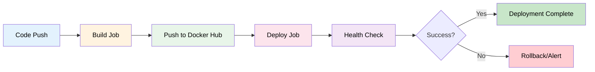

### Required GitHub Secrets

Configure the following secrets in your GitHub repository:

**Settings → Secrets and variables → Actions → New repository secret**

| Secret Name | Description | Example Value |
|-------------|-------------|---------------|
| `DOCKER_USERNAME` | Your Docker Hub username | `johndoe` |
| `DOCKER_PASSWORD` | Your Docker Hub password or access token | `dckr_pat_xxxxx` |
| `EC2_HOST` | Public IP address of your EC2 instance | `54.123.45.67` |
| `EC2_SSH_KEY` | Private SSH key for EC2 access | Contents of your `.pem` file |

### Setting Up GitHub Secrets

1. Navigate to your GitHub repository
2. Click **Settings** → **Secrets and variables** → **Actions**
3. Click **New repository secret**
4. Enter the secret name and value
5. Click **Add secret**
6. Repeat for all four required secrets

### Docker Hub Access Token (Recommended)

Instead of using your Docker Hub password, create an access token:

1. Log in to [Docker Hub](https://hub.docker.com/)
2. Go to **Account Settings** → **Security** → **Access Tokens**
3. Click **New Access Token**
4. Give it a description (e.g., "GitHub Actions")
5. Set permissions to **Read & Write**
6. Copy the token and use it as `DOCKER_PASSWORD` secret

### Workflow Triggers

The CI/CD pipeline automatically triggers on:

- **Push to main branch**: Automatic deployment
- **Push to master branch**: Automatic deployment
- **Manual trigger**: Via GitHub Actions UI (workflow_dispatch)

### Manual Workflow Trigger

1. Go to your GitHub repository
2. Click **Actions** tab
3. Select the deployment workflow
4. Click **Run workflow**
5. Select branch and click **Run workflow**

## Deployment Instructions

### Initial Deployment to EC2

After setting up your EC2 instance, perform the initial deployment:

#### Step 1: Upload Configuration Files

From your local machine:

```bash
# Set your EC2 IP and key path
EC2_IP=<your-ec2-public-ip>
KEY_PATH=your-key.pem

# Upload docker-compose.yml
scp -i $KEY_PATH docker-compose.yml ubuntu@$EC2_IP:/home/ubuntu/meanapp/

# Upload nginx.conf
scp -i $KEY_PATH nginx.conf ubuntu@$EC2_IP:/home/ubuntu/meanapp/

# Upload .env file (with production values)
scp -i $KEY_PATH .env ubuntu@$EC2_IP:/home/ubuntu/meanapp/
```

#### Step 2: Create Environment File on EC2

SSH into EC2 and create `.env` file:

```bash
ssh -i $KEY_PATH ubuntu@$EC2_IP

cd /home/ubuntu/meanapp

# Create .env file with production values
cat > .env << EOF
DOCKER_USERNAME=your_dockerhub_username
MONGO_USERNAME=admin
MONGO_PASSWORD=SecurePassword123!
MONGO_DATABASE=meanapp
NODE_ENV=production
PORT=3000
API_URL=http://localhost/api
EOF
```

#### Step 3: Start the Application

```bash
# Pull Docker images
docker-compose pull

# Start all services
docker-compose up -d

# Verify containers are running
docker-compose ps

# Check logs
docker-compose logs -f

# Test the application
curl http://localhost/api/tutorials
```

#### Step 4: Verify Deployment

```bash
# Check container status
docker-compose ps

# Expected output:
# NAME                  STATUS              PORTS
# meanapp-nginx         Up X minutes        0.0.0.0:80->80/tcp
# meanapp-frontend      Up X minutes        80/tcp
# meanapp-backend       Up X minutes        3000/tcp
# meanapp-mongodb       Up X minutes        27017/tcp

# Test frontend
curl http://localhost/

# Test backend API
curl http://localhost/api/tutorials

# Check MongoDB connection
docker-compose exec backend node -e "console.log('Connected')"
```

### Automated Deployment via GitHub Actions

Once CI/CD is configured, deployments happen automatically:

```bash
# Make changes to your code
git add .
git commit -m "Update feature"
git push origin main

# GitHub Actions will automatically:
# 1. Build new Docker images
# 2. Push images to Docker Hub
# 3. Deploy to EC2
# 4. Run health checks
```

### Deployment Verification

After deployment, verify the application:

```bash
# From your local machine
EC2_IP=<your-ec2-public-ip>

# Test frontend
curl http://$EC2_IP/

# Test backend API
curl http://$EC2_IP/api/tutorials

# Open in browser
open http://$EC2_IP/
```

## Environment Variables

### Environment Variables Reference

| Variable | Description | Required | Default | Example |
|----------|-------------|----------|---------|---------|
| `DOCKER_USERNAME` | Docker Hub username | Yes | - | `johndoe` |
| `MONGO_USERNAME` | MongoDB admin username | Yes | - | `admin` |
| `MONGO_PASSWORD` | MongoDB admin password | Yes | - | `SecurePass123!` |
| `MONGO_DATABASE` | MongoDB database name | Yes | - | `meanapp` |
| `NODE_ENV` | Node.js environment | No | `development` | `production` |
| `PORT` | Backend API port | No | `8080` | `3000` |
| `API_URL` | Backend API URL for frontend | Yes | - | `http://localhost/api` |

### Configuration Files

#### `.env.example` - Template

```bash
# Docker Hub Configuration
DOCKER_USERNAME=your_dockerhub_username

# MongoDB Configuration
MONGO_USERNAME=admin
MONGO_PASSWORD=secure_password_here
MONGO_DATABASE=meanapp

# Backend Configuration
NODE_ENV=production
PORT=3000

# Frontend Configuration
API_URL=http://localhost/api
```

#### Creating Your `.env` File

```bash
# Copy the example file
cp .env.example .env

# Edit with your actual values
nano .env
```

**Important**: Never commit `.env` file to Git. It's already in `.gitignore`.

### Environment-Specific Configuration

#### Local Development

```bash
DOCKER_USERNAME=your_username
MONGO_USERNAME=admin
MONGO_PASSWORD=localpass123
MONGO_DATABASE=meanapp_dev
NODE_ENV=development
PORT=8080
API_URL=http://localhost:8080/api
```

#### Production (EC2)

```bash
DOCKER_USERNAME=your_username
MONGO_USERNAME=admin
MONGO_PASSWORD=StrongProductionPassword123!
MONGO_DATABASE=meanapp
NODE_ENV=production
PORT=3000
API_URL=http://your-ec2-ip/api
```

## Screenshots

### 1. GitHub Actions - All Builds

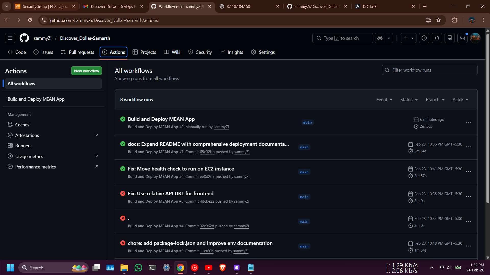

*Screenshot of GitHub Actions showing all workflow builds and their status.*

### 2. GitHub Actions - Build Process

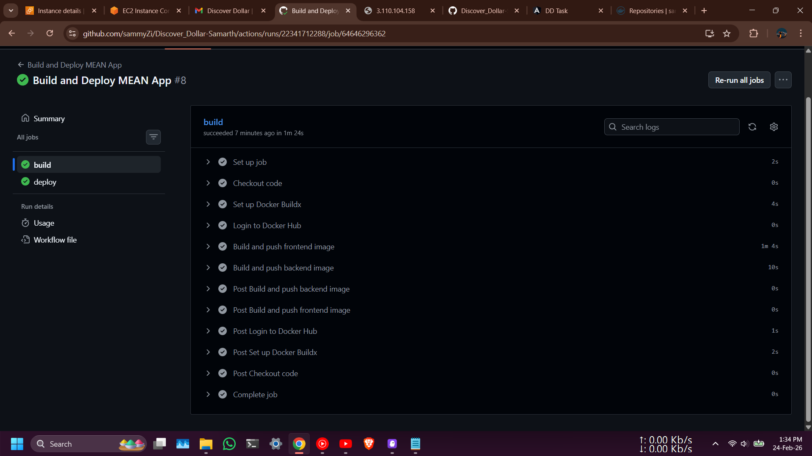

*Screenshot showing the GitHub Actions build job in progress.*

### 3. Successful CI/CD Pipeline Execution

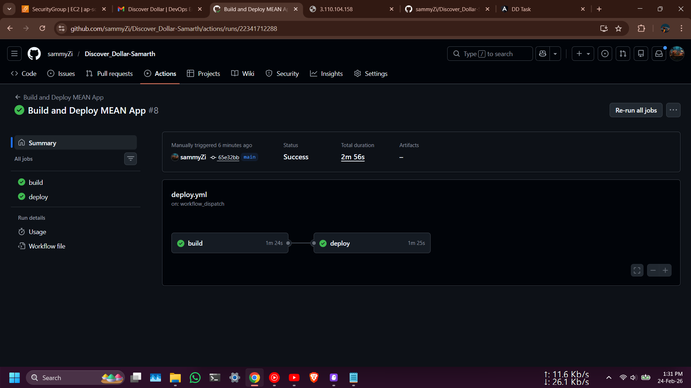

*Screenshot of a successful GitHub Actions workflow run showing all jobs completed.*

### 4. Docker Hub - Pushed Images


*Screenshot of Docker Hub repository showing the frontend and backend images with tags.*

### 5. AWS EC2 Instance

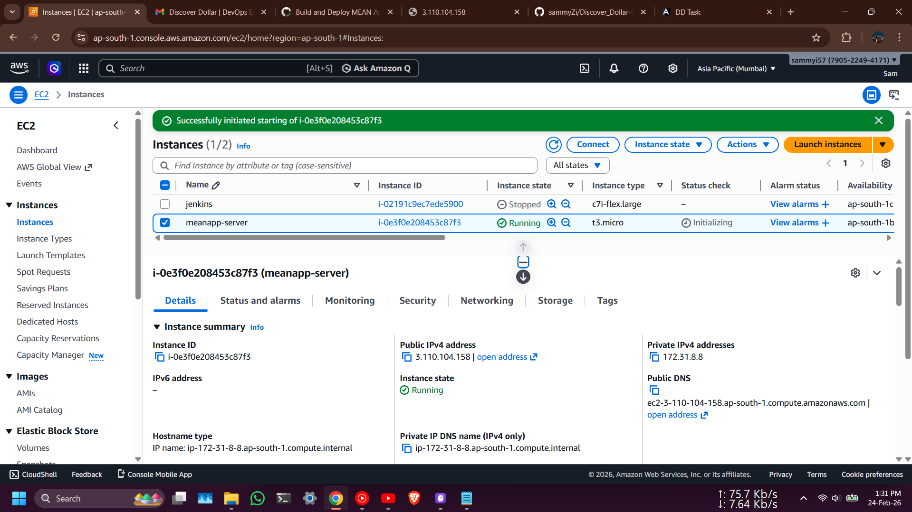

*Screenshot of AWS EC2 console showing the running instance.*

### 6. AWS Security Group Rules

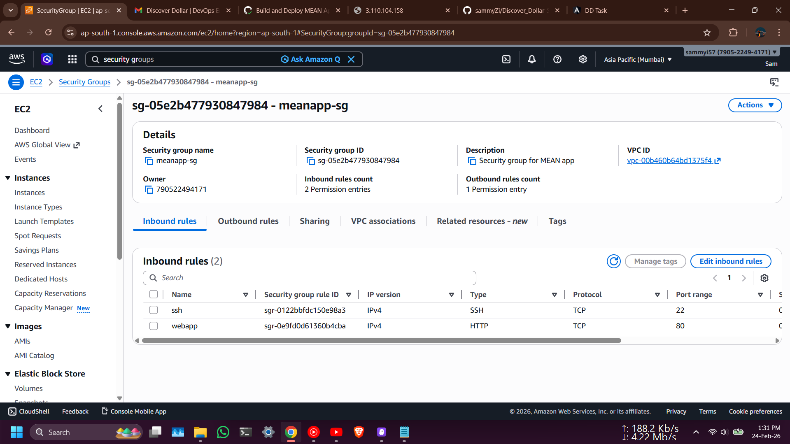

*Screenshot of AWS security group showing inbound rules for HTTP and SSH.*

### 7. Docker Compose - Running Containers

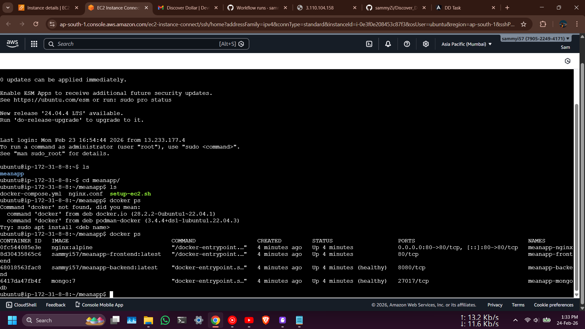

*Screenshot of terminal showing `docker-compose ps` output with all running containers.*

### 8. Application - Tutorial List

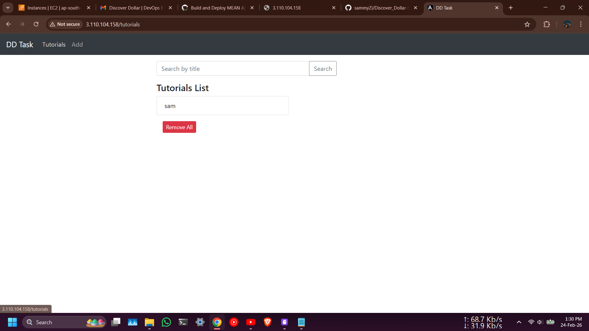

*Screenshot showing the list of tutorials in the application.*

### 9. Application - Tutorials List View


*Screenshot of the tutorials list view in the application interface.*

### 10. Application - Tutorial Added

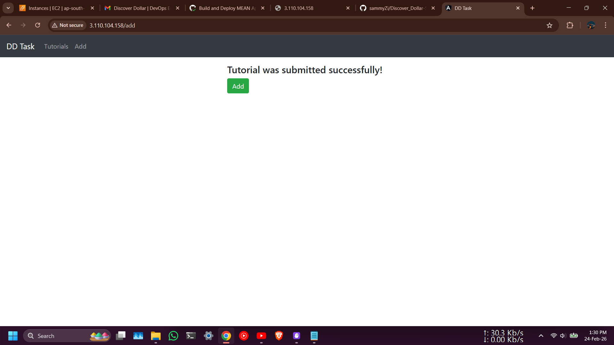

*Screenshot showing a successfully added tutorial in the application.*

## Troubleshooting

### Common Issues and Solutions

#### 1. Containers Not Starting

**Problem**: Containers fail to start or exit immediately.

**Solution**:

```bash
# Check container logs
docker-compose logs backend
docker-compose logs frontend
docker-compose logs mongodb

# Check container status
docker-compose ps

# Restart specific service
docker-compose restart backend

# Rebuild and restart
docker-compose up -d --build
```

#### 2. MongoDB Connection Failed

**Problem**: Backend cannot connect to MongoDB.

**Symptoms**:
- Backend logs show connection errors
- API requests return 500 errors

**Solution**:

```bash
# Check MongoDB is running
docker-compose ps mongodb

# Check MongoDB logs
docker-compose logs mongodb

# Verify environment variables
docker-compose exec backend env | grep MONGO

# Test MongoDB connection from backend container
docker-compose exec backend nc -zv mongodb 27017

# Restart backend after MongoDB is healthy
docker-compose restart backend
```

#### 3. Port Already in Use

**Problem**: Cannot start containers because port 80 is already in use.

**Solution**:

```bash
# Check what's using port 80
sudo lsof -i :80
# or
sudo netstat -tulpn | grep :80

# Stop the conflicting service
sudo systemctl stop apache2  # if Apache is running
sudo systemctl stop nginx    # if Nginx is running

# Or change the port in docker-compose.yml
# ports:
#   - "8080:80"  # Use port 8080 instead
```

#### 4. Docker Hub Authentication Failed

**Problem**: Cannot push images to Docker Hub.

**Solution**:

```bash
# Login to Docker Hub
docker login

# Verify credentials
docker info | grep Username

# Use access token instead of password
# Create token at: https://hub.docker.com/settings/security
```

#### 5. GitHub Actions Deployment Failed

**Problem**: GitHub Actions workflow fails during deployment.

**Common Causes**:

**SSH Connection Failed**:
```bash
# Verify EC2 is running
aws ec2 describe-instances --instance-ids i-xxxxx

# Test SSH connection locally
ssh -i your-key.pem ubuntu@$EC2_IP

# Check security group allows SSH from GitHub Actions IPs
# GitHub Actions IP ranges: https://api.github.com/meta
```

**Docker Compose Pull Failed**:
```bash
# SSH into EC2
ssh -i your-key.pem ubuntu@$EC2_IP

# Login to Docker Hub on EC2
docker login

# Manually pull images
docker-compose pull

# Check disk space
df -h
```

#### 6. Application Not Accessible

**Problem**: Cannot access application via EC2 public IP.

**Solution**:

```bash
# Check security group allows HTTP (port 80)
# Inbound rule: Type=HTTP, Port=80, Source=0.0.0.0/0

# Check Nginx is running
docker-compose ps nginx

# Check Nginx logs
docker-compose logs nginx

# Test locally on EC2
ssh -i your-key.pem ubuntu@$EC2_IP
curl http://localhost/

# Check if EC2 public IP changed
# Get current IP from AWS Console
```

#### 7. Frontend Cannot Reach Backend

**Problem**: Frontend shows errors when calling API.

**Solution**:

```bash
# Check API_URL in frontend environment
docker-compose exec frontend env | grep API_URL

# Test backend from frontend container
docker-compose exec frontend curl http://backend:3000/api/tutorials

# Check Nginx proxy configuration
docker-compose exec nginx cat /etc/nginx/nginx.conf

# Test Nginx routing
curl http://localhost/api/tutorials
```

#### 8. Data Loss After Container Restart

**Problem**: MongoDB data is lost when container restarts.

**Solution**:

```bash
# Check volume is defined in docker-compose.yml
docker-compose config | grep volumes

# List Docker volumes
docker volume ls

# Inspect MongoDB volume
docker volume inspect meanapp_mongodb_data

# Ensure volume is mounted correctly
docker-compose exec mongodb df -h | grep /data/db
```

#### 9. Disk Space Full

**Problem**: EC2 instance runs out of disk space.

**Solution**:

```bash
# Check disk usage
df -h

# Remove unused Docker resources
docker system prune -a -f

# Remove old images
docker image prune -a -f

# Remove unused volumes (WARNING: may delete data)
docker volume prune -f

# Check Docker disk usage
docker system df -v

# Rotate logs
sudo truncate -s 0 /var/lib/docker/containers/*/*-json.log
```

#### 10. Slow Performance

**Problem**: Application is slow or unresponsive.

**Solution**:

```bash
# Check container resource usage
docker stats

# Check EC2 instance metrics in AWS Console
# CPU, Memory, Network

# Increase EC2 instance size if needed
# (Note: May exceed Free Tier)

# Check MongoDB indexes
docker-compose exec mongodb mongosh -u $MONGO_USERNAME -p $MONGO_PASSWORD
# > use meanapp
# > db.tutorials.getIndexes()

# Add indexes if needed for better query performance
```

### Getting Help

If you encounter issues not covered here:

1. **Check logs**: `docker-compose logs -f`
2. **Check GitHub Actions logs**: In your repository's Actions tab
3. **Check AWS CloudWatch**: For EC2 instance metrics
4. **Docker documentation**: https://docs.docker.com/
5. **GitHub Actions documentation**: https://docs.github.com/en/actions

### Useful Commands

```bash
# View all container logs
docker-compose logs -f

# View specific service logs
docker-compose logs -f backend

# Execute command in container
docker-compose exec backend bash

# Check container resource usage
docker stats

# Restart all services
docker-compose restart

# Rebuild specific service
docker-compose up -d --build backend

# Remove all containers and volumes
docker-compose down -v

# Check Docker disk usage
docker system df

# Clean up Docker resources
docker system prune -a
```
